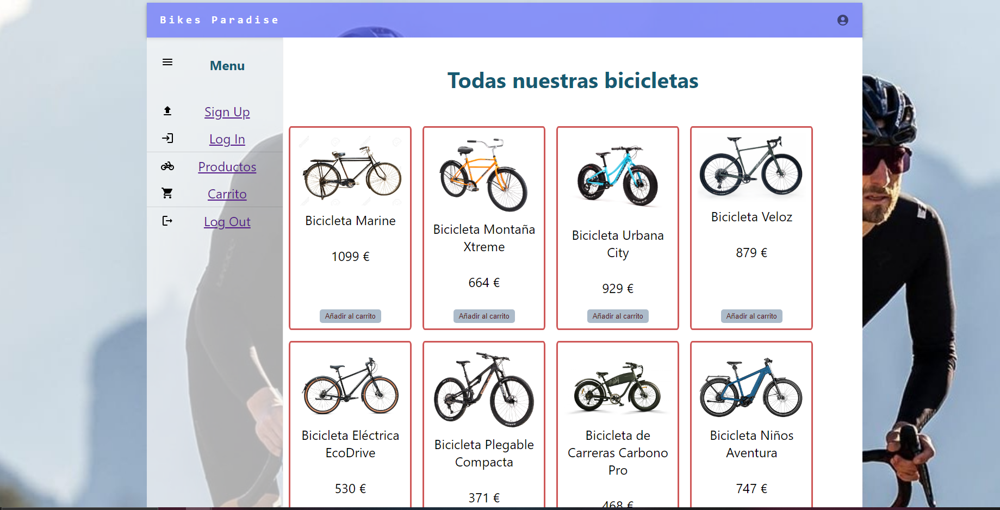
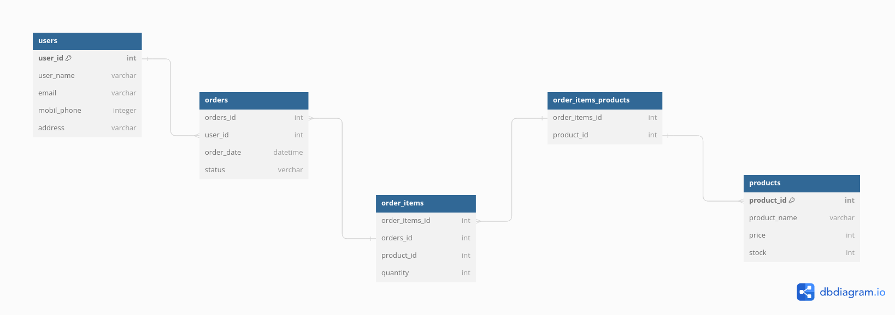

# Bike's Paradise - Your Digital Bicycle Store
Welcome to Bike's Paradise - your ultimate destination for top-quality digital bicycles!

# Summary
Project Name: Bike's Paradise
Vision: Our vision is to create a seamless platform connecting bicycle enthusiasts with premium digital bicycles that cater to their unique needs.
Purpose: We aim to simplify the process of finding and purchasing bicycles online, offering a diverse range of options and personalized services to our customers.
Commitment: At Bike's Paradise, we are committed to delivering top-notch digital bicycles within a reasonable timeframe, ensuring customer satisfaction and timely delivery.

# About Bike's Paradise
Bike's Paradise embodies the essence of cycling joy and adventure. We strive to provide a dynamic platform that offers a delightful shopping experience for cyclists of all levels. The name "Bike's Paradise" reflects our dedication to creating a haven for bicycle enthusiasts where they can find their perfect ride.

# Our Services
Basic Informative Bicycle Website Development
Dynamic Bicycle Website Development
E-commerce (Online Bicycle Store) Development
PLUS Prototype (1-week turnaround)
User Profiles
Admin: Full management and supervision.
Dev: Freelance developers selected through interviews and technical tests.
Client: Bicycle enthusiasts seeking premium digital bicycles.

# Web Design

 
# Tables and Relationships
Tables
 

# Relationships Between Tables
Users:
Each user can have multiple orders.
Orders:
Belongs to a user.
Each order can have multiple order items.
OrderItems:
Each order item can belong to multiple orders.
Products:
Belongs to many order items.
Products_OrderItems:
Junction table linking products and order items.

# Endpoints
| METHOD | ENDPOINT          | TOKEN | ROLE | DESCRIPTION              | POST PARAMS                               | RETURNS               |
|--------|-------------------|-------|------|--------------------------|-------------------------------------------|------------------------|
| POST   | /auth/signup | -     | client | New client Signup           | first_name, last_name, email, password | { token: token }       |
| POST   | /auth/login  | -     | - | User Login            | email, password                           | { token: token }       |

### User Endpoints

| METHOD | ENDPOINT         | TOKEN | ROLE | DESCRIPTION              | POST PARAMS                                     | RETURNS               |
|--------|------------------|-------|------|--------------------------|-------------------------------------------------|------------------------|
| GET    | /user            | YES   | admin| Get all users            | Query params                                    | [{user}]              |
| GET    | /user/:userId    | YES   | admin| Get one user             | -                                               | {user}                |
| GET    | /user/profile    | YES   | -    | Get own profile          | -                                               | {user}                |
| POST   | /user            | YES   | admin| Create one user          | first_name, last_name, email, password, role | {user}        |
| PUT    | /user/:userId    | YES   | admin| Update one user          | first_name, last_name, email, password, role | {message: "User updated!"} |
| PUT    | /user/profile    | YES   | -    | Update user profile (client and developer only update own profile)         | first_name, last_name, email, password, role | {message: "Profile updated!"} |
| PUT    | /user/profile/password   | YES   | -    | Reset user password (client and developer only reset own password)         | newPassword | {message: "Password updated!"} |
| DELETE | /user/:userId    | YES   | admin | Delete one user          | -                                               | {message: "User deleted!"} |
| DELETE | /user/profile    | YES   | -    | Delete user profile (client and developer only delete own profile)         | -                                               | {message: "Profile deleted!"} |
# Getting Started
To get started with Bike's Paradise, follow these steps:

Signup/Login: Create an account or login to access Bike's Paradise services.
Explore: Browse through our wide range of digital bicycles and services.
Customize: Tailor your bicycle selection to meet your specific needs.
Checkout: Complete your purchase securely and conveniently.
Enjoy: Start enjoying your premium digital bicycle experience!
Happy cycling! 🚴‍♀️🚴‍♂️